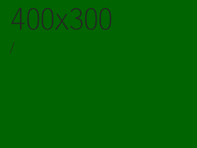
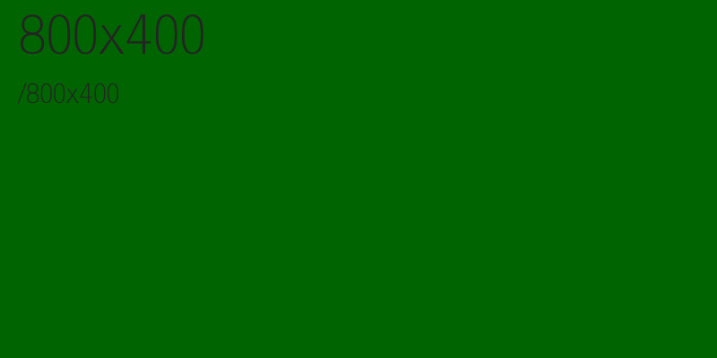
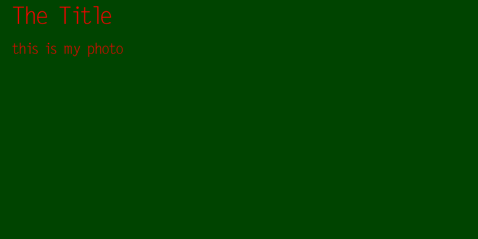

### DummyImage
-----

A simple app to generate dummy/filler images on the fly at whatever size you want.

### http://192.168.1.201:8421/

### http://192.168.1.201:8421/800x400

### http://192.168.1.201:8421/path/to/800x400.png?title=The%20Title&title_size=40&content=this%20is%20my%20photo&content_size=25&fontcolor=FF0000&bgcolor=004400

#### Query Parameters
-------

Available parameters:

* bgcolor=006400: background color
* fontcolor=242424: font color
* title=400x300: the title
* title_size=60: font size of the title
* content=The Content: the content
* content_size=30: font size of the content
* image size in url： http://ip:8421/image/filename/$widthx$height.png